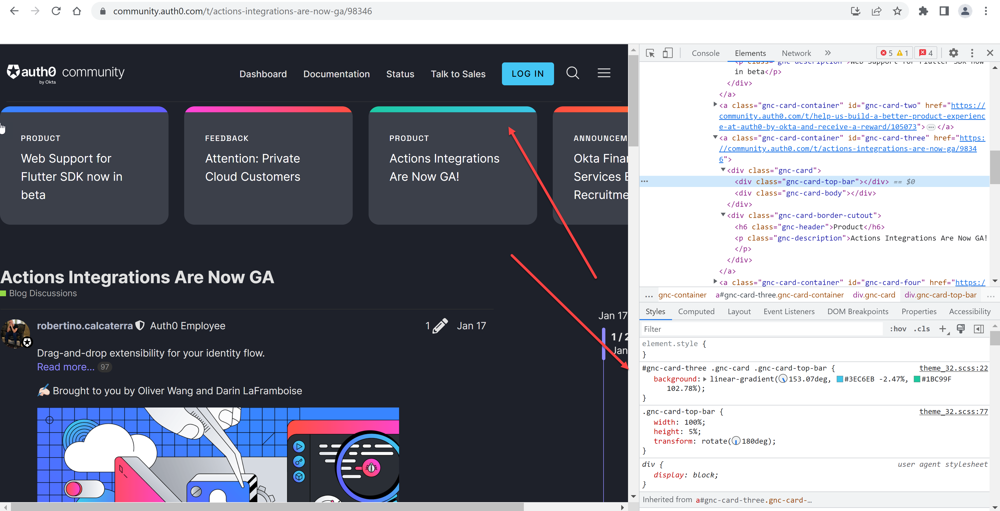
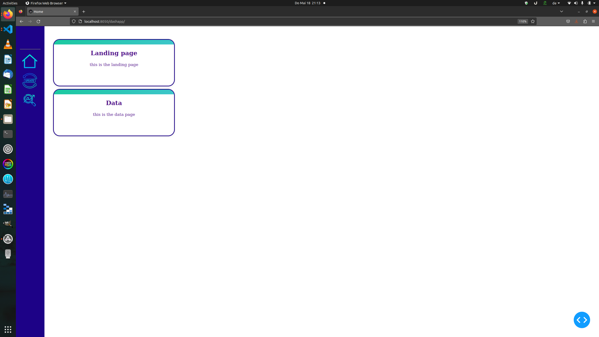

# basic_dashapp

The idea is to create an basic app to test new cool box layouts and app integrations.

Start was this link: https://community.auth0.com/t/actions-integrations-are-now-ga/98346

## Actual Layout

